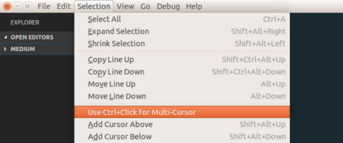

## VS CODE BEST EXTENSIONS 2020

**Auto Close Tag**

**Auto Rename Tag**

**AutoFileName**

**HTML Snippets**

**Indent on Paste**

**JS Snippet**

**PHP IntelliSense**

**PHP Snippets**

**Sublime Text Keymap and Settings Importer**

**Trailing Semicolon**

**CSS Peek**

**HTML Boilerplate**

**Dracula Official**

**Java Snippets** ext install tushortz.java-snippets

**Language support for java**

**Visual Studio Intellicode**

**TabNine**

**Nord**

**Rainbow brackets**

**Code runner**

To config code runner: settings.json > code-runner.executorMap

``"code-runner.executorMap": {
        "python": "python3 -u"
    }
    "code-runner.runInTerminal": true,
    "code-runner.clearPreviousOutput": true,
    ``

[Snippets personalizados](/vscode/snippets)

%appdata%\Code\User

[keybindings.json](keybindings.json)

[old.settings.json](old.settings.json)

Integrated Terminal

File -> Preferences -> Setting -> Features -> Terminal -> Inherit Env

[Como instalar Java no VS CODE](/vscode/java.md)
